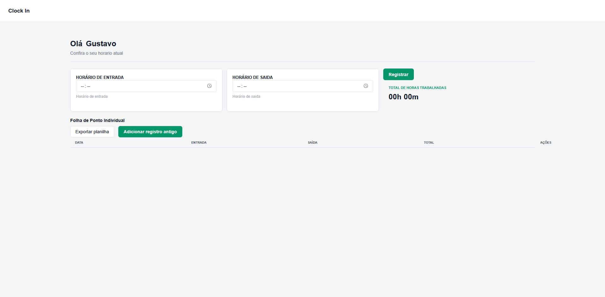
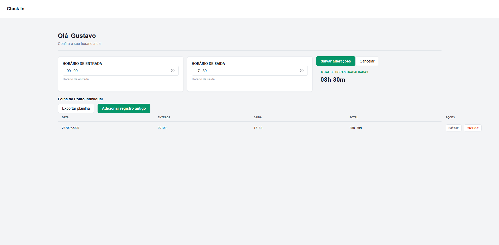

#  Clock In

Sistema web para registro e acompanhamento de horas trabalhadas, desenvolvido com React.

O projeto permite registrar horários de entrada e saída, calcular automaticamente o total de horas trabalhadas e manter um histórico dos registros realizados.

---

##  Preview

### Tela inicial



### Registro de horas



---

##  Sobre o projeto

O **Clock In** foi desenvolvido com o objetivo de praticar conceitos de desenvolvimento Front-End utilizando React.

A aplicação permite que o usuário registre sua jornada de trabalho informando o horário de entrada e saída. O sistema calcula automaticamente o total de horas trabalhadas e adiciona o registro à folha de ponto.

Também é possível editar registros já existentes, excluir registros, adicionar registros de dias anteriores e exportar os dados para uma planilha.

---

##  Funcionalidades

- Registro do horário de entrada e saída
- Cálculo automático das horas trabalhadas
- Visualização do total de horas
- Histórico de registros
- Adição de registros antigos
- Edição de registros
- Exclusão de registros
- Exportação dos registros para planilha
- Interface responsiva e simples de utilizar

---

##  Tecnologias utilizadas

- React
- JavaScript
- HTML5
- CSS3
- Git
- GitHub

---

##  Conceitos praticados

Durante o desenvolvimento deste projeto foram utilizados conceitos como:

- Componentização com React
- Gerenciamento de estado com `useState`
- Comunicação entre componentes através de `props`
- Manipulação de formulários
- Manipulação de arrays e objetos
- Renderização dinâmica de dados
- Eventos em React
- Cálculo e formatação de horários
- Organização de componentes
- Persistência de dados no navegador
- Exportação de dados

---

##  Como executar o projeto

### 1. Clone o repositório

```bash
git clone URL_DO_SEU_REPOSITORIO